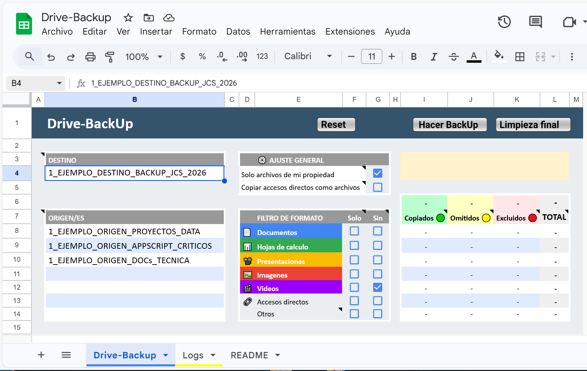
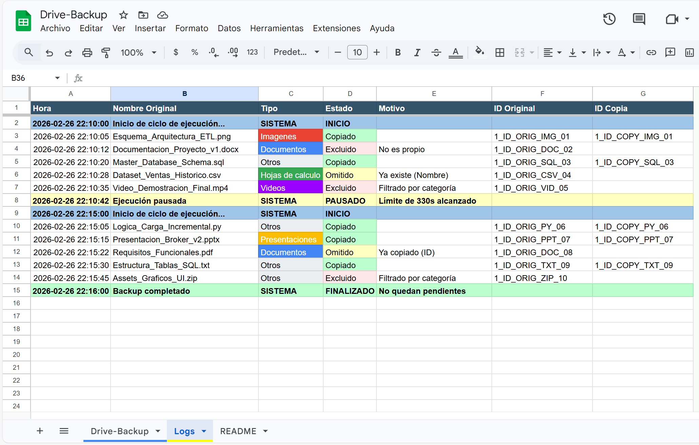
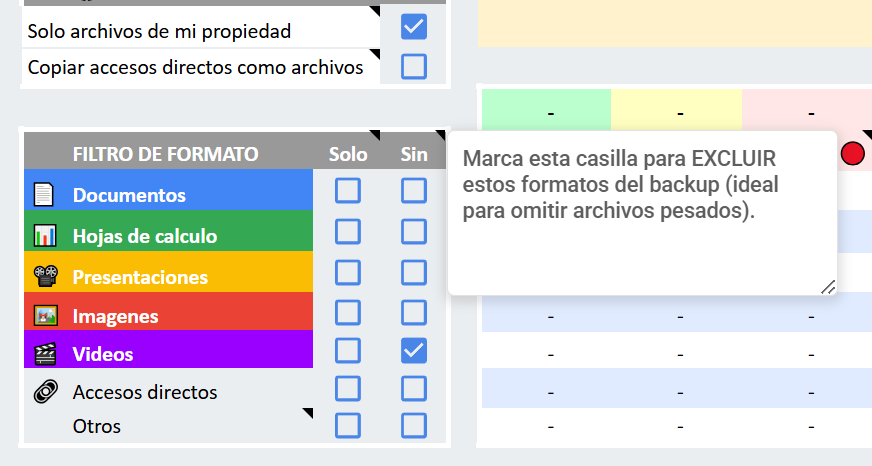

# Drive-BackUp 0.94 🚀

### Motor de Respaldo Estructural y Preservación de Lógica para Google Drive

Este proyecto resuelve limitaciones críticas de infraestructura en el ecosistema de Google Drive, permitiendo la clonación recursiva de directorios y la salvaguarda de la lógica de negocio contenida en scripts vinculados.

---

## 🛠️ El Problema
* **Limitaciones de Copia Nativa**: Google Drive no permite copiar carpetas de forma recursiva manteniendo su jerarquía original.
* * **DRP (Disaster Recovery Plan) para Ecosistemas**: A diferencia del historial nativo de Apps Script —que es granular, difícil de restaurar y depende de la existencia del archivo original—, **Drive-BackUp** crea copias independientes y funcionales de archivos + scripts. Esto garantiza la recuperación inmediata ante borrados accidentales o corrupción de contenedores.
* **Auditoría de Estado**: Evita los límites de 9 KB de memoria interna usando una base de datos externa (Logs) transparente y editable.

  

---

## ✨ Características Principales
* **Algoritmo DFS (Depth-First Search)**: Recreación exacta de estructuras de directorios.
* **Memoria Persistente en Logs**: Uso de la **Columna F** como base de datos de estado para evitar duplicados.
* **Dashboard UX**: Interfaz con tooltips técnicos y scorecards semafóricos.

  
* **Filtrado Inteligente de Categorías**: Permite discriminar archivos por tipo (Documentos, Imágenes, etc.) y gestionar específicamente los archivos de la categoría "Otros" (ej: .zip, .py, .rar).

---

## 📊 Auditoría y Saneamiento

* **Optimización y Metadatos**: Al ejecutar la función de Limpieza final, el sistema no solo elimina directorios vacíos, sino que sincroniza automáticamente en la descripción de la carpeta raíz el conteo total de archivos y el volumen en MB del backup.
* **Batch Operations**: Procesamiento de logs en lotes de 20 entradas para maximizar el rendimiento y respetar las cuotas de API de Google.

---

## ⚙️ Instrucciones de Configuración
1. **[Click aquí para copiar la Plantilla oficial]** (Se abrirá en una pestaña nueva).

  

2. **Destino**: Pegar el ID de la carpeta destino en la celda **B4**.
3. **Orígenes**: Listar los IDs de las carpetas a respaldar en el rango **B8:B14**.
4. **Filtros**: Seleccionar mediante los checkboxes si se desea incluir (**Solo**) o excluir (**Sin**) categorías específicas.
5. **Ejecución**: Presionar el botón **"Hacer BackUp"** para iniciar el proceso incremental.
6. **Mantenimiento**: Utilizar el botón **"Limpieza final"** para borrar directorios vacíos y actualizar métricas de volumen.

---

## 🚀 Hoja de Ruta (Roadmap)
- [ ] **Automatización One-Click**: Implementación de un botón para crear activadores (triggers) automáticos, evitando la necesidad de interactuar con el editor de código.
- [ ] **Continuation Tokens & Chained Executions**: Sistema de paginado y auto-reanudación mediante ScriptApp.newTrigger() para procesamientos masivos que superen los 6 min, logrando una autonomía del 100% (Zero-Setup).
- [ ] **Monitor de Estado en Home (C3)**: Configuración de celda de telemetría para informar en tiempo real el último archivo procesado y el estado general sin consultar los Logs.
- [ ] **Smart Shortcuts (Revinculación)**: Sistema de doble pasada para evaluar accesos directos y reescribir su TargetId, asegurando que apunten a las copias del backup y no a los originales.
- [ ] **Data Lineage & Formula Translator**: Script de post-procesamiento para realizar un Find & Replace automático de IDs en fórmulas (como IMPORTRANGE) dentro de los Sheets copiados, manteniendo la integridad referencial.
- [ ] **Métricas de Transferencia**: Visualización de velocidad de procesamiento y volumen total respaldado por sesión.

